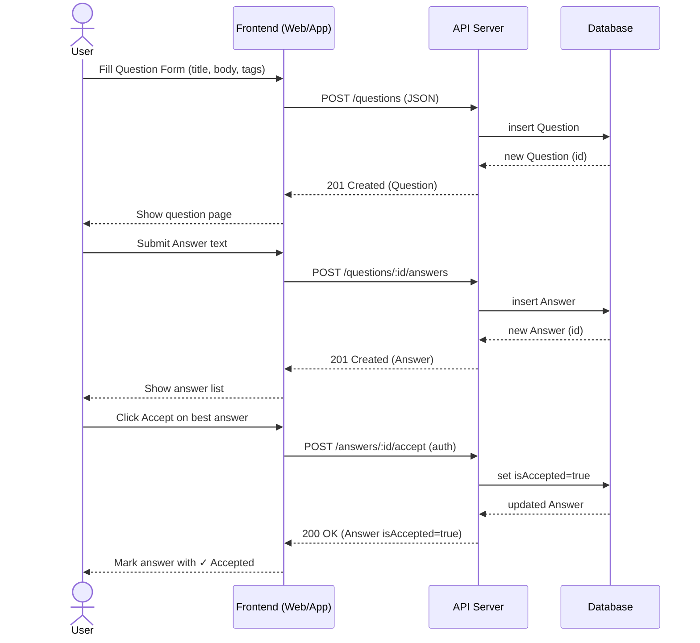

# UC-2: Post a Question & Accept an Answer

**Owner:** Teammate B
**Scope:** Provide API examples and a simple UI mock/sequence diagram suitable for slides.

---

## 1) Quick Overview (for the slide title)

* Users can post questions, others post answers, and the asker can accept one answer.
* Three core endpoints:

  1. `POST /questions`
  2. `POST /questions/:id/answers`
  3. `POST /answers/:id/accept`

---

## 2) Data Model (minimal)

**Question**

```json
{
  "id": "q_123",
  "title": "How do I connect to the VPN?",
  "body": "I installed AnyConnect but it fails to connect...",
  "tags": ["vpn", "network"],
  "authorId": "u_42",
  "createdAt": "2025-09-05T18:30:00Z"
}
```

**Answer**

```json
{
  "id": "a_555",
  "questionId": "q_123",
  "body": "Open AnyConnect and choose 'Point Park VPN – CMPS' group.",
  "authorId": "u_77",
  "isAccepted": false,
  "createdAt": "2025-09-05T18:35:00Z"
}
```

---

## 3) API Examples (copy-ready)

### A. POST /questions

**Purpose:** Create a new question

**Request (JSON)**

```json
{
  "title": "How do I connect to the VPN?",
  "body": "I installed AnyConnect but it fails to connect...",
  "tags": ["vpn", "network"]
}
```

**Response 201 (JSON)**

```json
{
  "id": "q_123",
  "title": "How do I connect to the VPN?",
  "body": "I installed AnyConnect but it fails to connect...",
  "tags": ["vpn", "network"],
  "authorId": "u_42",
  "createdAt": "2025-09-05T18:30:00Z"
}
```

**Errors**

* 400: Missing/invalid title/body
* 401: Unauthorized (login required)

**Example curl**

```bash
curl -X POST https://api.example.com/questions \
  -H "Authorization: Bearer <token>" \
  -H "Content-Type: application/json" \
  -d '{
    "title": "How do I connect to the VPN?",
    "body": "I installed AnyConnect but it fails to connect...",
    "tags": ["vpn", "network"]
  }'
```

---

### B. POST /questions/\:id/answers

**Purpose:** Add an answer to a question

**Request (JSON)**

```json
{
  "body": "Open AnyConnect and choose 'Point Park VPN – CMPS' group."
}
```

**Response 201 (JSON)**

```json
{
  "id": "a_555",
  "questionId": "q_123",
  "body": "Open AnyConnect and choose 'Point Park VPN – CMPS' group.",
  "authorId": "u_77",
  "isAccepted": false,
  "createdAt": "2025-09-05T18:35:00Z"
}
```

**Errors**

* 400: Missing/invalid body
* 401: Unauthorized
* 404: Question not found

**Example curl**

```bash
curl -X POST https://api.example.com/questions/q_123/answers \
  -H "Authorization: Bearer <token>" \
  -H "Content-Type: application/json" \
  -d '{
    "body": "Open AnyConnect and choose \"Point Park VPN – CMPS\" group."
  }'
```

---

### C. POST /answers/\:id/accept

**Purpose:** Mark an answer as accepted (only the question author may do this)

**Request:** No body required

**Response 200 (JSON)**

```json
{
  "id": "a_555",
  "questionId": "q_123",
  "isAccepted": true,
  "acceptedAt": "2025-09-05T18:40:00Z"
}
```

**Errors**

* 401: Unauthorized
* 403: Not the question owner
* 404: Answer not found

**Example curl**

```bash
curl -X POST https://api.example.com/answers/a_555/accept \
  -H "Authorization: Bearer <token>"
```

---

## 4) Simple UI Mock (wireframe)

```
+---------------------------------------------------+
|  Ask a Question                                   |
|  [Title: ________________________________]        |
|  [Body:  ______________________________________]  |
|          ______________________________________   |
|  [Tags: vpn, network]   (Post Question) [Button]  |
+---------------------------------------------------+

+---------------------------------------------------+
|  Question: How do I connect to the VPN?           |
|  Details: I installed AnyConnect...               |
|  Tags: vpn, network | Asked by u_42 | 2 min ago   |
|---------------------------------------------------|
|  Answers (2)                                      |
|  - u_77: Open AnyConnect and choose ...   [Accept]|
|  - u_88: Check your creds; use CMPS group         |
|                                                   |
|  [Your Answer: ________________________________]   |
|  (Post Answer) [Button]                           |
+---------------------------------------------------+
```

---

## 5) Sequence Diagram (Mermaid for slides)



---

## 6) Validation & Auth Notes (1 slide)

* **Auth:** Bearer JWT; login required for posting/accepting.
* **Rate limits:** e.g., 30 requests/min/user.
* **Validation:**

  * `title`: 10–150 chars
  * `body`: 10–5,000 chars
  * `tags`: 0–5 items, kebab-case
* **Permissions:** Only question author can accept an answer.

---

## 7) HTTP Status Cheat Sheet (tiny slide)

* **201 Created:** question/answer created
* **200 OK:** answer accepted
* **400 Bad Request:** invalid input
* **401 Unauthorized:** login required
* **403 Forbidden:** not the owner
* **404 Not Found:** missing question/answer

---

## 8) Optional: Minimal Schemas (OpenAPI-ish)

```yaml
QuestionCreate:
  type: object
  required: [title, body]
  properties:
    title: { type: string, minLength: 10, maxLength: 150 }
    body:  { type: string, minLength: 10, maxLength: 5000 }
    tags:
      type: array
      maxItems: 5
      items: { type: string, pattern: "^[a-z0-9-]{1,24}$" }

AnswerCreate:
  type: object
  required: [body]
  properties:
    body: { type: string, minLength: 10, maxLength: 5000 }
```

---

## 9) Copy Blocks for Slides

* **Slide 1 (Title):** UC-2 – Post a Question & Accept an Answer
* **Slide 2 (API Endpoints):** `POST /questions`, `POST /questions/:id/answers`, `POST /answers/:id/accept`
* **Slide 3 (Flow):** Use the Mermaid diagram above or bullet the 3 steps.
* **Slide 4 (UI Mock):** Paste the wireframe box.
* **Slide 5 (Status/Rules):** Validation, Auth, Status codes.
