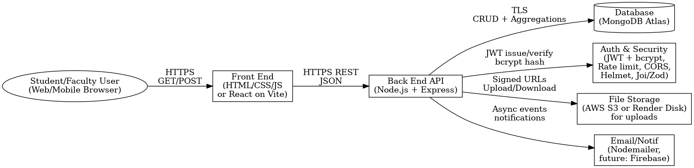

# Module 2 Submission — Academic Support Hub

## Live Project Link
- [Render Deployment (Week 2)](https://cmps-480-academic-support-hub.onrender.com/) - use Case 1 only tested

## GitHub Repository Link
- [GitHub Repo — Week 2 Branch](https://github.com/mlmartin44/CMPS-480---Academic-Support-Hub/tree/week-2)

---

## Use Cases & API Examples

### UC-1: Join a Study Group (Mariah)
**Preconditions**
- Student is logged in.
- At least one group exists for the selected course.

**Main Flow**
1. Student searches by course code or keyword.
2. System returns a list of groups with tags, schedule, and member count.
3. Student clicks **Join**.
4. System validates availability.
5. Student is added to roster or waitlist.

**Edge Cases**
- Group is full → waitlist option.
- Student already a member → prevent duplicate join.
- Schedule conflict → show warning.

**API Support**
- `GET /api/study-groups?course=CMPS262`
  ```json
  [
    {
      "_id": "sg_001",
      "course": "CMPS262",
      "title": "Algorithms Exam Prep",
      "tags": ["graphs", "sorting"],
      "schedule": {"day": "Tue", "time": "18:00", "tz": "America/New_York"},
      "maxSize": 8,
      "membersCount": 5,
      "isOpen": true
    }
  ]


### UC-2: Post a Question & Accept an Answer (Ethan)

(Teammate to fill in details, flows, and API examples)

### UC-3: Upload & Tag a Resource (Teammate C)

(Teammate to fill in details, flows, and API examples)

### UC-4: Assignment Planner with Calendar Sync (Brandon)

(Teammate to fill in details, flows, and API examples)

## Architecture Diagram


## Security Document
[text](<Security Document.docx>) 

